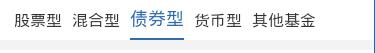
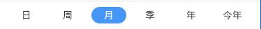

> tab 条组件

## 1. 效果

图1 



图2



## 2. 调用

```
<mob-bar-tab 
  :item="item"
/>
```

## 3. 配置

### 3.1 功能配置

图1

```
{
  tplid: "mob-bar-tab",
  tabs: [
    { title: "股票型", param: { "pro_type2": "11", "pro_type1_in": "(1)" } },
    { title: "混合型", param: { "pro_type2": "14", "pro_type1_in": "(1)" } },
    { title: "债券型", param: { "pro_type2": "13", "pro_type1_in": "(1)" } },
    { title: "货币型", param: { "pro_type2": "12", "pro_type1_in": "(1)" } },
    { title: "其他基金", param: { "pro_type2": "16", "pro_type1_in": "(1)" } },
  ],
  split: {},
  localStorageKey: "jjlist0"
}
```

图2

```
{
  tplid: "mob-bar-tab",
  toggleShow: toggleShow
  tabs: [
    { title: "日", param: { "orderby_field": "rzf" } },
    { title: "周", param: { "orderby_field": "zzf" } },
    { title: "月", param: { "orderby_field": "yzf" } },
    { title: "季", param: { "orderby_field": "jzf" } },
    { title: "年", param: { "orderby_field": "nzf" } },
    { title: "今年", param: { "orderby_field": "jnzf" } },
  ],
  style: {
    borderTop: "1px solid #ddd",
    justifyContent: "space-around"
  },
  tabItemStyle: {
    "fontSize": "14px",
    "width": "50px",
    "height": "24px"
  },
  tabItemSelStyle: {
    "backgroundColor": "#4696F5",
    "color": "#fff",
    "border": "0",
    "borderRadius": "12px"
  },
  localStorageKey: "jjlist2"
}
```

`localStorageKey` 是记录选中状态的 `localStorage` 的 `key`

`toggleShow` 确定该组件是否显示，（在 [page_jjlist](/doc/page_jjlist) 中会用到，不算组件的配置）

```
var toggleShow = function(queryParams) {

  var cplx = queryParams["pro_type2"];
  return cplx == "12" ? false : true;
}
```

### 3.2 颜色配置

```
mobBarTab: {
  tabItemSel: {
    color: "#2E6BB1",
    borderColor: "#2E6BB1"
  }
}
```

### 3.3 大小配置

```
mobBarTab: {
  tab: {
    height: "40px",
    padding: "0 10px"
  },
  tabItem: {
    fontSize: "16px",
    height: "38px",
    margin: "0px 5px"
  },
  tabItemSel: {
    fontSize: "18px"
  }
}
```

## 4. 事件

点击 `tabItem` 会发送事件，事件名称 `mob-bar-tab-item-click`，
参数为对应的 `param`