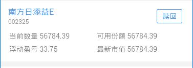

> 订单卡片组件

## 1. 效果



## 2. 调用

```
<mob-card-dd 
  :item="item"
  :data="data"
/>
```

## 3. 配置

### 3.1 功能配置

```
{
  tplid: "mob-card-dd",
  split: {},
  style: {
    padding: "10px 15px"
  },
  title: {
    field: "392",
    style: {
      color: "#4696F5"
    }
  },
  urlParam: {
    OpenName: "基金详情",
    OpenUrl: "jjxq.html",
    queryParams: [
      { key: "code", value: "391" }
    ]
  },
  code: {
    field: "391",
    style: {}
  },
  opBtn: {
    name: "赎回",
    style: {
      color: "#4696F5",
      borderColor: "#4696F5"
    },
    urlParam: {
      "OpenName": "基金赎回",
      "OpenType": "native",
      "OpenUrl": "jyhtml/works123/lcsc/otcsh.html?fromsc=1",
      "OpenParam": {
        UrlType: "Absolute",
        WebViewType: "JyURL"
      },
      queryParams: [
        { key: "F402", value: "391" }
      ]
    }
  },
  table: {
    style: {
      marginTop: "5px"
    },
    cols: [
      [
        {
          title: "当前数量",
          field: "10010"
        },
        {
          title: "可用份额",
          field: "410"
        }
      ],
      [
        {
          title: "浮动盈亏",
          field: "204"
        },
        {
          title: "最新市值",
          field: "205"
        }
      ]
    ]
  }
}
```

`urlParam` 点击 title 做跳转的操作

`opBtn` 操作按钮配置

`opBtn.urlFunc`, `opBtn.urlParam` 

2 种形式

一种是点击按钮执行自定义操作 `urlFunc`

```
urlFunc: function(data) {}
```

入参 `data` 是卡片行记录

`urlParam` 默认的跳转 url 配置

### 3.2 颜色配置

```
{
  mobCardDd: {
    box: {},
    title: {},
    code: {},
    opBtn: {},
    table: {},
    tdTitle: {},
    tdValue: {}
  }
}
```

### 3.3 大小配置

```
{
  mobCardDd: {
    box: {},
    title: {},
    code: {},
    opBtn: {},
    table: {},
    tdTitle: {},
    tdValue: {}
  }
}
```