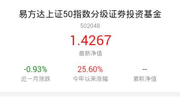

> 基金详情卡片

## 1. 效果



## 2. 调用

```
<mob-card-jj 
  :item="item"
  :data="data"
/>
```

`data` 必选，`Object` 行记录

## 3. 配置

### 3.1 功能配置

```
{
  tplid: "mob-card-jj",
  index: 0,
  split: {},
  style: {},
  typeField: "pro_type2",
  cardItems: [
    {
      typeValue: ["12"],
      title: {
        field: "pro_name",
        style: {}
      },
      code: {
        field: "pro_code",
        style: {}
      },
      sy: {
        field: "qrnhsy",
        title: "七日年化收益",
        format: "2%"
      },
      cols: [
        { field: "qgje", title: "起购金额", format: ".0f", suffix: "元" },
        { field: "wfsy", title: "万份收益", format: ".4f" },
        { field: "risk_level_name", title: "风险等级" },
      ]
    },
    {
      title: {
        field: "pro_name",
        style: {}
      },
      code: {
        field: "pro_code",
        style: {}
      },
      sy: {
        field: "nav",
        title: "最新净值",
        format: ".4f"
      },
      cols: [
        { field: "yzf", title: "近一月涨跌", format: "2%" },
        { field: "jnzf", title: "今年以来涨幅", format: "2%" },
        { field: "nav-total", title: "累积净值", format: ".4f" }
      ]
    },
  ],
}
```

### 3.2 颜色配置

```
mobCardJj: {
  title: {
    color: "#000"
  },
  code: {
    color: "rgba(0, 0, 0, 0.5)"
  },
  syValue: {},
  syTitle: {
    color: "rgba(0, 0, 0, 0.5)"
  },
  tdTitle: {
    color: "rgba(0, 0, 0, 0.5)"
  },
  tdValue: {}
}
```

### 3.3 大小配置

```
mobCardJj: {
  card: {
    padding: "15px 20px"
  },
  title: {
    fontSize: "18px",
    lineHeight: "30px"
  },
  code: {
    fontSize: "12px",
    lineHeight: "18px"
  },
  syValue: {
    fontSize: "28px",
    lineHeight: "40px"
  },
  syTitle: {
    fontSize: "12px",
    lineHeight: "14px"
  },
  tdTitle: {
    fontSize: "12px",
    lineHeight: "18px"
  },
  tdValue: {
    fontSize: "16px",
    lineHeight: "22px",
    marginTop: "12px"
  }
}
```

<p class="tip">
  具体的字段颜色配置，在 `mobCard` 的 `fieldColor` 中配置
</p>