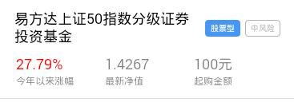

> 单基金产品详情

## 1. 效果



## 2. 调用

```
<mob-card 
  :item="item"
  :data="data"
/>
```

`data` 是一个行记录

```
{ ... }
```

## 3. 配置

### 3.1 功能配置

```
{
  tplid: "mobCard",
  typeField: "pro_type2",
  cardItems: [
    {
      typeValue: ["12"],
      title: {
        field: "pro_name",
        style: {}
      },
      cards: [
        {
          value: "基金",
          field: "pro_type2_name",
          class: "card-blue",
          style: {}
        },
        {
          field: "risk_level_name",
          class: "card-gray",
          style: {}
        }
      ],
      cols: [
        { field: "jnzf", title: "今年以来涨幅", format: "2%" },
        { field: "nav", title: "最新净值", format: ".4f" },
        { field: "qgje", title: "起购金额", format: ".0f", surfix: "元" }
      ]
    }
  ],
  urlParam: {
    OpenName: "产品详情",
    OpenUrl: "cpxq.html",
    queryParams: [
      { key: "code", value: "pro_code" },
      { key: "pro_type1", value: "pro_type1" },
      { key: "pro_type2", value: "pro_type2" }
    ]
  }
}
```

说明：

`cards` 中每个 `label` 标签，如果配置了 `value` 字段，那么 `field` 字段不会再生效了。

### 3.2 颜色配置

```
{
  mobCard: {
    title: {
      color: "#000"
    },
    tdTitle: {
      color: "rgba(0, 0, 0, 0.5)"
    },
    tdValue: {
      color: "rgba(0, 0, 0, 0.5)"
    },
    fieldColor: {
      "qrnhsy": ["red", "green", 3],
      "jnzf": ["red", "green", 3]
    }
  }
}
```

### 3.3 大小配置

```
{
  mobCard: {

    card: {
      padding: "10px 20px"
    },
    title: {
      fontSize: "18px",
      lineHeight: "22px",
      margin: "10px 0"
    },
    tdTitle: {
      fontSize: "12px",
      lineHeight: "18px"
    },
    tdValue: {
      fontSize: "18px",
      lineHeight: "24px"
    }
  }
}
```