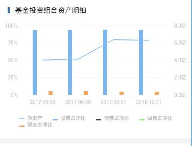

> 图表组件，柱状图或者线图

## 1. 效果



## 2. 调用

```
<mob-chart-bar 
  :item="item"
  :data="data"
/>
```

`data` 数据结构

```
[
  {...},
  {...},
  ...
]
```

## 3. 配置

### 3.1 功能配置

```
{
  tplid: "mob-chart-bar",
  index: 4,
  split: {},
  bar: {
    icon: {
      style: {
        backgroundColor: "#2E6BB1"
      }
    },
    title: "基金投资组合资产明细"
  },
  chart: {
    column: {
      title: ["股票占净比", "债券占净比", "回售占净比", "现金占净比"],
      xAxis: "date",
      yAxis: ["gp_zjzcb", "zq_zjzcb", "hs_zjzcb", "xj_zjzcb"]
    },
    line: {
      title: "净资产",
      xAxis: "date",
      yAxis: "jzc"
    },
    style: {}
  }
}
```

这里的 `line` 和 `column` 可选，配置某一个，那么就展示某一个。即，
单独配置 `line` 显示线型，单独配置 `column` 显示柱状。


### 3.2 颜色配置

```
mobChartBar: {
  chart: {}
}
```

### 3.3 大小配置

```
mobChartBar: {
  chart: {
    height: "280px"
  }
}
```