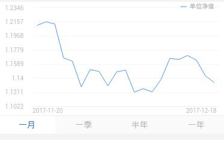

> 图表组件，普通的线型（一条线）

## 1. 效果



## 2. 调用

```
<mob-chart 
  :item="item"
  :data="data"
/>
```

## 3. 配置

### 3.1 功能配置

```
{
  tplid: "mob-chart",
  index: 3,
  split: {},
  chart: {
    title: function(data) {
      return data[0]["nav"] ? "单位净值" : "万份收益";
    },
    xAxis: "date",
    yAxis: function(data) {
      return data[0]["nav"] ? "nav" : "wfsy";
    }
  },
  chartBar: [
    { title: "一月", value: "-1" },
    { title: "一季", value: "-3" },
    { title: "半年", value: "-6" },
    { title: "一年", value: "-12" },
  ],
  chartBarSel: 0
}
```

### 3.2 颜色配置

```
mobChart: {

  barItem: {
    backgroundColor: "#fafafa",
    color: "#b4b4b4",
    borderColor: "#efefef"
  },
  barItemSel: {
    backgroundColor: "#fff",
    color: "#2e6bb1"
  }
}
```

### 3.3 大小配置

```
mobChart: {
  chart: {
    height: "230px"
  },

  barItem: {
    height: "30px"
  },

  barItemSel: {}
}
```