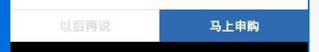

> 表单按钮组件

## 1. 效果



## 2. 调用

```
<mob-form-button 
  :item="item"
  :data="data"
/>
```

`data` 格式

```
{
  key: value,
  key: value,
  ...
}
```

## 3. 配置

### 3.1 功能配置

```
{
  tplid: "mob-form-button",
  btns: [
    {
      name: "以后再说",
      style: {
        borderTop: "1px solid #ddd",
        borderRight: "1px solid #ddd",
        height: "40px",
      },
      disabledStyle: {},
      urlFunc: btnCaClick
    },
    {
      name: "马上申购",
      style: {
        borderTop: "1px solid #ddd",
        height: "40px",
        color: "#fff",
        backgroundColor: "#2E6BB1",
        borderColor: "#2E6BB1"
      },
      disabledStyle: {
        color: "#ddd",
        backgroundColor: "#fff",
        borderColor: "#ddd"
      },
      urlFunc: btnOkClick,
      checkDisabledFunc: checkDisabledFunc
    }
  ],
  style: {
    color: "#ddd",
    fontWeight: "bold"
  },
  showFunc: function() {}
}
```

`btns` 每个按钮的配置，具体

```
{
  name: "",
  getBtnName: function() {},
  style: {},
  disabledStyle: {},
  checkDisabledFunc: function(ckParams) {},
  urlFunc: function(data, ckParams) {},
  urlParam: {}
}
```

`checkDisabledFunc` 判断按钮是否可点击函数，这个用在 `form` 表单中，通过监听消息 `mob-form-button-check` 来驱动。
入参 `ckParams` 为表单输入的一些数据，如 `mob-form-input` 这些组件的内容。

```
  /*
    @param { Object } ckParams 搜集的消息 mob-form-button-check 的内容
  */
  function checkDisbledFunc(ckParams) {

  }
```

`urlFunc` 按钮点击响应函数，入参 `data, ckParams` 一个是行记录，一个是表单输入

```

  /*
  
    @param { Object|Array|undefined } list 文件中 index 下标需要的 dataCache 数据
    @param { Object } ckParams 搜集的消息 mob-form-button-check 的内容
    @param { Object } 组件 this
  */
  function urlFunc(data, ckParams, vm) {

  }

```

`urlParam` 如果上面的 `urlFunc` 没有定义，那么这个配置就生效，表示跳转

`showFunc` 判断这个组件是否显示的函数，默认显示，监听 `mob-form-button-show` 来判断是否显示，消息入参会给到 `showFunc`。
函数返回值，true - 显示，false - 隐藏。

### 3.2 颜色配置

```
{
  mobFormButton: {
    btnWrapper: {},
    btn: {},
    btnDisabled: {}
  }
}
```

### 3.3 大小配置

```
{
  mobFormButton: {
    btnWrapper: {},
    btn: {},
    btnDisabled: {}
  }
}
```

## 4. 消息

### 4.1 mob-form-button-check

监听 `mob-form-button-check` 消息

```
event.$on("mob-form-button-check", this.onBtnCheck);

onBtnCheck: function(params) {
  this.ckParams = $.extend({}, this.ckParams, params);
},
```

### 4.2 mob-form-button-show

监听 `mob-form-button-show`, 判断按钮显示还是隐藏

```
event.$on("mob-form-button-show", this.onCheckShow);

onCheckShow: function(show) {

  let { showFunc } = this.item;
  if(typeof showFunc == "function") {
    this.show = showFunc(show);
  }
  else {
    this.show = true;
  }      
}
```