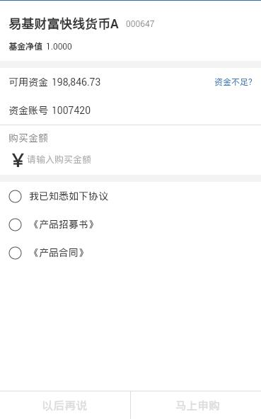

> 总的表单组件

## 1. 效果



## 2. 调用

```
<mob-form 
  :item="item"
  :data="data"
/>
```

`data` 格式

```
{
  key: value,
  key: value
}
```

## 3. 配置

### 3.1 功能配置

```
{
  tplid: "mob-form",
  split: {},
  index: 0,
  style: {},
  rows: [],
  foot: []
}
```

`rows` 表单主要部分的配置，每个小单位的配置都是一个表单小组件。如 `mob-form-span`, `mob-form-input`

`foot` 这部分配置底部区域，例如按钮部分。

<p class="warning">注意一旦检查到有 `foot` 的配置，表示整个界面都是表单内容。</p>

### 3.2 颜色配置

### 3.3 大小配置

## 4. 一些解释

### 4.1 一些事件

当整个 `mob-form` 用于交易表单的时候，我们经常有需求只有界面上的一些内容输入了，按钮才能可点。
这里 `mob-form` 与各个表单子组件的通讯是使用 `event` 消息来做的。

通过监听表单子组件的消息，合并子组件发送过来的参数，形成我们需要 `check` 的参数。 

```
event.$on("mob-form-input-change", this.formChange);
event.$on("mob-form-xys-check", this.formChange);
```

在需要的子组件中通过监听，`mob-form-button-check` 的变化，来确定按钮是否可点击。

```
// 表单中有内容变化时
formChange: function(params) {
  this.formParams = $.extend({}, this.formParams, params);
  event.$emit("mob-form-button-check", this.formParams);
}
```

最直接的例子就是在 `mob-form-button` 中

```
getBtnStyle: function(btn) {

  let { checkDisabledFunc } = btn;
  let isDisabled = false;
  if(typeof checkDisabledFunc == "function") {
    isDisabled = checkDisabledFunc(this.ckParams);
  }
  
  let disabledStyle;
  if(isDisabled) {
    disabledStyle = $.extend({}, this.btnDisabledStyle, btn.disabledStyle);
  }

  return $.extend({}, this.btnStyle, btn.style, disabledStyle);
},

onBtnCheck: function(params) {
  this.ckParams = params;
},
```

### 4.2 表单组件中的记录

表单的配置

```
{
  tplid: "mob-form",
  index: 1,
  ...
}
```

这里需要配置 `index`, 这样会把 `dataCache[1]` 中的数据传到 `mob-form` 中。至于表单的各个
子组件，它们共享 `mob-form` 的数据结构。

表单输入的数据，通过监听 `mob-form-button-check` 事件，在入参中获取并更新。

所以我们会在 `mob-form-button` 组件中看到，点击认购按钮执行的操作会有2个入参，一个是产品的信息数据，
一个是表单界面的输入数据

```
var btnOkClick = function(row, form) {
  
  var info = "<div style='line-height: 26px;'>" +
                "<span>请确认交易！</span><br>" +
              "</div style='line-height: 26px;'><div>" +
                "<span>操作类别：</span><span>申购</span>" +
              "</div><div style='line-height: 26px;'>" +
                "<span>购买金额：</span><span>" + form.gmje + "</span>" +
              "</div>";
  tdxConfirm({
    content: info,
    ok: function() {
      onSgSdx(row, form);
    }
  });
}
```