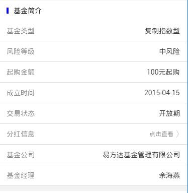

> 基金详情 list 样式组件配置

## 1. 效果



## 2. 调用

```
<mob-list-jjxq 
  :item="item"
  :data="data"
/>
```

`data` 必须，格式 

```
{
  key: value,
  ...
}
```

<p style="color: red;">(如果 data 为 undefined 那么这里不会显示记录)</p>

1. 我们可以设置 `line` 配置中的 `show: true` 来消除 `data` 为 `undefined` 导致行不显示的问题

## 3. 配置

### 3.1 功能配置

```
{
  tplid: "mob-list-jjxq",
  index: 1,
  split: {},
  bar: {
    icon: {
      style: {}
    },
    title: "基金简介"
  },
  lines: [
    { title: "基金类型", field: "investment_style" },
    { title: "风险等级", field: "risk_level_name" },
    { title: "起购金额", field: "qgje", format: ".0f", suffix: "元起购" },
    { title: "成立时间", field: "pro_begin_date" },
    { title: "交易状态", field: "pro_status_name" },
    { title: "分红信息", subTitle: "点击查看", urlParam: {
      "OpenName": "分红信息",
      "OpenUrl": "fhxx.html",
      "queryParams": [
        { key: "pro_code", value: "pro_code" },
        { key: "pro_type1", value: "pro_type1" },
        { key: "pro_type2", value: "pro_type2" }
      ],
      show: true
    } },
    { title: "基金公司", field: "pro_manager" },
    { title: "基金经理", field: "fund_manager" }
  ],
  lineStyle: {
    borderBottom: "1px solid #ddd"
  },
  titleStyle: {},
  image: {
    url: "arrow.png",
    style: {}
  }
}
```

### 3.2 颜色配置

```
mobListJjxq: {
  title: {
    color: "rgba(0, 0, 0, 0.5)"
  },
  subTitle: {
    color: "rgba(0, 0, 0, 0.5)"
  }
}
```

### 3.3 大小配置

```
mobListJjxq: {
  line: {
    padding: "0 15px",
    height: "40px"
  },
  subTitle: {
    fontSize: "12px"
  },
  value: {},
  image: {
    width: "8px",
    height: "16px",
    marginLeft: "5px"
  }
}
```

## 4. 动态 url 返回

<p class="tip">
  对于动态返回的 url 内容，这个是根据应答返回来显示协议书内容
</p>

需要这样配置

```
{
  tplid: "mob-list-jjxq",
  index: 2,
  split: {},
  bar: {
    icon: {
      style: {}
    },
    title: "相关协议"
  },
  lines: [
    { 
      title: "基金招募说明书", 
      urlParam: {
        "OpenName": "基金招募说明书",
        "OpenUrl": "fhxx.html",
        "queryParams": [
          { key: "url", value: "zms" }
        ],
        OpenParam: {
          UrlType: "Remote"
        },
        OpenType: __tdxMobSystem == "Android" ? "browser" : "native"
      } 
    },
    { 
      title: "基金合同", 
      urlParam: {
        "OpenName": "基金合同",
        "OpenUrl": "fhxx.html",
        "queryParams": [
          { key: "url", value: "ht" }
        ],
        "OpenParam": {
          UrlType: "Remote"
        },
        "OpenType": __tdxMobSystem == "Android" ? "browser" : "native"
      } 
    },
    { 
      title: "风险揭示书", 
      urlParam: {
        "OpenName": "风险揭示书",
        "OpenUrl": "fhxx.html",
        "queryParams": [
          { key: "url", value: "jss" }
        ],
        OpenParam: {
          UrlType: "Remote"
        },
        OpenType: __tdxMobSystem == "Android" ? "browser" : "native"
      } 
    },
    { 
      title: "证券投资基金投资者风险提示函", 
      urlParam: {
        "OpenName": "证券投资基金投资者风险提示函",
        "OpenUrl": "fhxx.html",
        "queryParams": [
          { key: "url", value: "tzzfxtsh" }
        ],
        "OpenParam": {
          UrlType: "Remote"
        }
      } 
    },
    { 
      title: "证券投资基金投资人权益须知", 
      urlParam: {
        "OpenName": "证券投资基金投资人权益须知",
        "OpenUrl": "fhxx.html",
        "queryParams": [
          { key: "url", value: "txrqyxz" }
        ],
        "OpenParam": {
          UrlType: "Remote"
        }
      } 
    }
  ],
  lineStyle: {
    borderBottom: "1px solid #ddd"
  },
  image: {
    url: "arrow.png",
    style: {}
  }
}
```