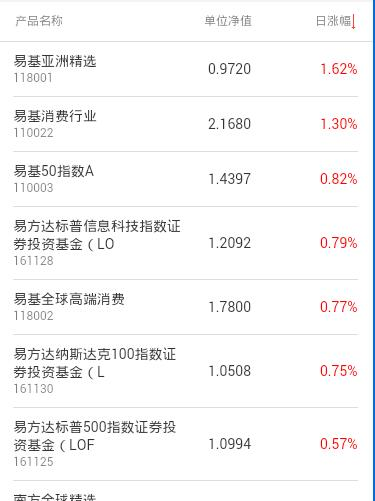

> 列表组件，带分页

## 1. 效果



## 2. 调用

```
<mob-list-page
  :item="item"
  :data="data"
  :loading="loading"
  :hasNextPage="hasNextPage"
/>
```

`data` 格式

```
[
  { ... },
  { ... },
  ...
]
```

## 3. 配置

### 3.1 功能配置

```
{
  tplid: "mob-list-page",
  getCols: getCols,
  cols: [
    { title: "", field: "", subField: "", sort: false, align: "", format: "", style: {} },
    ....
  ],
  simpleList: 1,
  pageSize: 20,
  urlParam: {
    OpenName: "产品详情",
    OpenUrl: "jjxq.html",
    queryParams: [
      { key: "code", value: "pro_code" },
      { key: "pro_type1", value: "pro_type1"},
      { key: "pro_type2", value: "pro_type2"},
    ]
  },
  queryParam: {
    // 分页请求、排序 字段
    ...
  }
}
```

`getCols` 这个元素内容是一个函数，用于动态获取 `cols` 的值。（在 [page_jjlist](/doc/page_jjlist) 页面逻辑中会用到，如果是一般的使用，可以不用这个参数）。

`cols` 列表列配置，多列，多字段（`field`, `subField`）

`pageSize` 每页大小，默认20

`simpleList` 如果配置1，表示组件单独使用，而不是在 `jjlist` 中使用，这个时候也不要使用 `getCols`

### 3.2 颜色配置

```
mobListPage: {
  head: {
    color: "rgba(0, 0, 0, 0.5)"
  },
  bodyCol: {
    borderColor: "#ddd"
  },
  td0: {
    color: "#333"
  },
  td1: {
    color: "rgba(0, 0, 0, 0.5)"
  }
}
```

对于单个字段颜色的单独配置，统一到 `mobList` 配置中。

```
mobList: {
  fieldColor: {
    "rzf": ["red", "green", 3],
    "zzf": ["red", "green", 3],
    "yzf": ["red", "green", 3],
    "jzf": ["red", "green", 3],
    "nzf": ["red", "green", 3],
    "jnzf": ["red", "green", 3],
    "qrnhsy": ["red", "green", 3],
  }
}
```

### 3.3 大小配置

```
mobListPage: {
  head: {
    height: "40px",
    padding: "0 15px",
    fontSize: "12px"
  },
  headCol: {
    height: "30px",
  },
  body: {
    padding: "0 15px"
  },
  bodyCol: {
    padding: "10px 0"
  },
  td0: {
    fontSize: "14px",
    lineHeight: "18px"
  },
  td1: {
    fontSize: "12px",
    lineHeight: "16px"
  }
}
```

## 4. 一些特性

### 4.1 分页

组件默认有分页效果，就是说滚动列表会触发分页请求，但是没有具体的分页请求，
而是通过消息发送出去，这个时候，我们需要在 `page` ([点击这里](/doc/page_jjlist)) 逻辑中监听这个函数，来
实际到达分页效果。

事件

```
<!-- 消息名 -->
mob-list-page-nextpage

<!-- 参数无 -->
{}
```

### 4.2 关于排序

该组件有字段排序逻辑，要开通某个字段的排序，可以类似下面的配置

```
{
  cols: [
    { ..., sort: true, ... }
  ]
}
```

点击表头字段，会发送字段排序消息，具体的实现需要在 `page` （[点击这里](/doc/page_jjlist)）逻辑中实现。

事件

```
<!-- 消息名 -->
mob-list-page-sort-click

<!-- 参数 -->
{
  sortField: ...,
  sortType: ...
}
```

`sortType`, 2 - 降序，1 - 升序

**排序内部具体的实现逻辑**

```
headColClick: function(col) {

  if(!col.sort) return;

  this.listToTop();

  let param = {};
  let footField = this.queryParam["foot_field"];
  let sortField = this.queryParam["sortField"] || footField;
  let sortType = this.queryParam["sortType"] || "2";
  
  if(col.field != sortField) {
    sortType = "2";
    sortField = col.field;
  }
  else {
    sortType = sortType == "2" ? "1" : "2";
  }

  event.$emit("mob-list-page-sort-click", { sortType, sortField });
},

getSortClass: function(col) {

  let footField = this.queryParam["foot_field"];
  let sortField = this.queryParam["sortField"] || footField;
  let sortType = this.queryParam["sortType"] || "2";

  if(!col.sort || col.field != sortField) {
    return;
  }

  if(sortType == 2) {
    return "sort-desc";
  }
  else {
    return "sort-asc";
  }
}
```