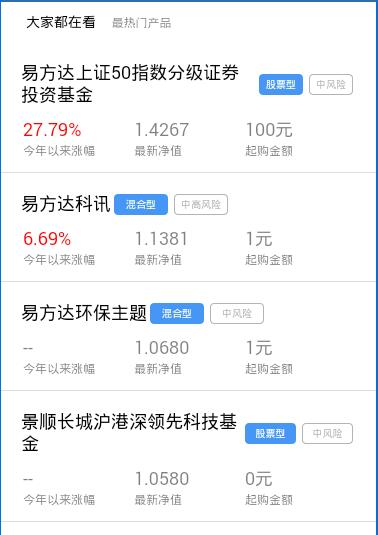

> 普通的列表组件

## 1. 效果



## 2. 调用

```
<mob-list 
  :item="item"
  :data="data"
/>
```

`data` 数据格式

```
[
  { ... },
  { ... },
  ...
]
```

## 3. 配置

### 3.1 功能配置

```
{
  tplid: "mob-list",
  index: 1,
  bar: {
    title: "大家都在看",
    subTitle: "最热门产品"
  },
  card: {
    tplid: "mobCard",
    typeField: "pro_type2",
    cardItems: [
      {
        typeValue: ["12"],
        title: {
          field: "pro_name",
          style: {}
        },
        cards: [
          {
            field: "pro_type2_name",
            class: "card-blue",
            style: {}
          },
          {
            field: "risk_level_name",
            class: "card-gray",
            style: {}
          }
        ],
        cols: [
          { field: "jnzf", title: "今年以来涨幅", format: "2%" },
          { field: "nav", title: "最新净值", format: ".4f" },
          { field: "qgje", title: "起购金额", format: ".0f", surfix: "元" }
        ]
      }
    ],
    urlParam: {                           // 点击卡片部分跳转配置
      OpenName: "产品详情",
      OpenUrl: "cpxq.html",
      queryParams: [
        { key: "code", value: "pro_code" },
        { key: "pro_type1", value: "pro_type1"},
        { key: "pro_type2", value: "pro_type2"},
      ]
    }
  }
}
```

`item.card.tplid` 这个是卡片的组件 id，默认 `mob-card`

### 3.2 颜色配置

### 3.3 大小配置