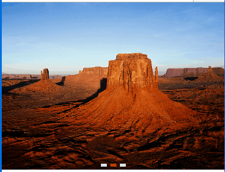

> 图片轮播组件

## 1. 效果



## 2. 调用

`vue` 中使用方式

```

<mob-slider-image
  :class="getComponentClass(item)"
  :style="getComponentStyle(item)"
  :item="item"
  :data="data"
/>

```

`item` 功能配置

`data` 动态请求的数据，这里是为了使得功能配置中图片的地址可以通过请求动态获取

格式：

```
{
  ErrorCode: "",
  ErrorInfo: "",
  rows: [等同于 images 的结构]
}
```

## 3. 配置

### 3.1 功能配置

文件： `mob_list_xxx.js`

内容：

```
  {
    tplid: "mobSliderImage",
    images: [
      {
        url: "Chrysanthemum.jpg",
        openParam: {
          OpenUrl: "http://www.baidu.com"
        }
      },
      {
        url: "Desert.jpg"
      },
      {
        url: "Hydrangeas.jpg"
      }
    ],
    delay: 4000,
    style: {},
    flx: 0,
    split: {}
  }
```

`tplid` 必选，组件 id，`mobSliderImage` 或者 `mob-slider-image`

`images` 必选，图片配置

`delay` 可选，定时器轮播配置，默认 2000 毫秒，单位毫秒

`style` 可选，样式配置

`flx` 可选，该组件是否缩放，0 - 不缩放（默认），1 - 缩放，自适应剩下的空间

`split` 可选，该组件是否有一个向下的间隔

内容格式

```
split: {
  style: {}
}
```

### 3.2 颜色，大小配置

文件：`color_set.js`，或者其他皮肤的 js 文件

内容：

```
var tdx_color = {

  ...
  mobSliderImage: {
    spot: {
      backgroundColor: "#ddd"
    },
    spotSel: {
      backgroundColor: "red"
    }
  }
}
```

`spot` 下方的原点配置，未选中的

`spotSel` 选中原点的配置

文件：`size_set.js`

内容：

```
var tdx_size = {
  ...
  mobSliderImage: {
    spot: {
      width: "10px",
      height: "5px",
      borderSize: "0"
    },
    spotSel: {
      width: "10px",
      height: "5px",
      borderSize: "0"
    }
  }
}
```