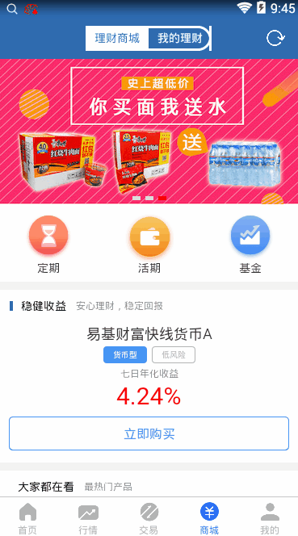

> 商城首页界面

这里是配置商城首页的业务模板，通过这个模板，我们可以配置不同组件组成的商城首页。
主要包括：轮播图，广告栏，重点推荐单产品，热门产品列表等等

## 0. 显示效果



## 1. mob_list_xxx.js

在这个文件中，我们配置需要的一些组件。

```
var mob_list_xxx = {
  items: [
    { 每个组件的配置 }
  ]
}
```
## 2. mob_send_xxx.js

这个文件处理我们的数据逻辑部分。首页业务逻辑中，每个组件可能来源的数据是不同的请求。
所以这里的数据存放方式，通过组件配置中的 `index` 内容，来指定组件使用哪部分数据。
这里有 2 个函数

**GetSendData**

```

var GetSendData = function(n, json) {
  
  var funcid;
  var ix = new IXContent();
  switch(n) {

    case 1:
      funcid = "HQ.TSTC.10038";
      ix.Set("tdxOrigin", "1");
      break;
    default:
      break;
  }

  return [funcid, ix];
}

```

`n` 对应的是 `mob_list_xxx.js` 中组件配置的 `index` 值，那么对应的数据，会存放在
`dataCache[n]` 中。

**SetDataField**

```

var SetDataField = function(data, n, vm) {

  if(n == 1) {
    
    var res = data.match(/{[^}]+}/);
    if(res) {
      res = res[0];
      res = JSON.parse(res);

      // 获取一元起投，稳健收益，热门的数据
      var wjsy = res.wjsy;
      var hot = res.hot;

      getWjsyData(wjsy, vm);
      getHotData(hot, vm);

      data = undefined;
    }
  }

  return data;
}

```

`data`： `case n` 应答返回，`FormatResult` 或者没有格式化的数据

`n`：`case n` 的下标

`vm`：整个 `vue` 对象，通过设置 `vm.dataCache[n]` 来获取值

## 3. 示例代码

**mob_list_index.js**

```
var getOpUrlParam = function(data) {
  var status = data["pro_status"];
  var urlParam = [
    {
      OpenName: "申购",
      OpenUrl: "jyhtml/works123/lcsc/otcsg.html?fromsc=1&PageID=Mobile.OTC.OTCSGTRD",
      OpenParam: {
        UrlType: "Absolute",
        WebViewType: "JyURL"
      },
      queryParams: [
        { key: "F402", value: "pro_code" }
      ],
      requireLogin: 1
    },
    {
      OpenName: "认购",
      OpenUrl: "jyhtml/works123/lcsc/otcrg.html?fromsc=1&PageID=Mobile.OTC.OTCSGTRD",
      OpenParam: {
        UrlType: "Absolute",
        WebViewType: "JyURL"
      },
      ueryParams: [
        { key: "F402", value: "pro_code" }
      ],
      requireLogin: 1
    }
  ];

  if(status == "1") {
    return urlParam[0];
  }
  else if(status == "2") {
    return urlParam[1];
  }
}

var mob_list_index = {
  
  items: [
    {
      tplid: "mob-slider-image",
      images: [
        { url: "http://img.ishequ360.com/images/test/banner1@1x.jpeg" },
        { url: "http://img.ishequ360.com/images/test/banner6@1x.jpeg" },
        { url: "http://img.ishequ360.com/images/test/banner3@1x.jpeg" },
      ],
      style: {}
    },
    {
      tplid: "mob-nav-icon",
      navs: [
        {
          url: "nav-dq.png",
          title: "定期"
        },
        {
          url: "nav-hq.png",
          title: "活期"
        },
        {
          url: "nav-jj.png",
          title: "基金"
        }
      ],
      split: {}
    },
    {
      tplid: "mob-card-op",
      split: {},
      index: 0,
      toggleShow: 1,                          // 可选，是否根据数据请求，有隐藏的需求
      split: {},                              // 可选，是否带分隔
      bar: {
        tplid: "mob-bar",
        icon: {
          style: {
            backgroundColor: "#2E6BB1"
          }
        },
        title: "稳健收益",
        subTitle: "安心理财，稳定回报"
      },
      card: {                                 // 卡片区域
        title: {                              // 卡片标题
          field: "pro_name",
          style: {}
        },
        cards: [                              // label 部分配置
          {
            field: "pro_type2_name",
            class: "card-blue",
            style: {}
          },
          {
            field: "risk_level_name",
            class: "card-gray",
            style: {}
          }
        ],
        sy: {
          name: "七日年化收益",
          nameStyle: {},
          field: "qrnhsy",
          fieldStyle: {},
          format: "2%"
        },
        op: {
          name: "立即购买",
          style: {},
          urlParam: getOpUrlParam
        },
        urlParam: {                           // 点击卡片部分跳转配置
          OpenName: "产品详情",
          OpenUrl: "jjxq.html",
          queryParams: [
            { key: "code", value: "pro_code" },
            { key: "pro_type1", value: "pro_type1"},
            { key: "pro_type2", value: "pro_type2"},
          ]
        }
      }
    },
    {
      tplid: "mob-list",
      index: 1,
      bar: {
        title: "大家都在看",
        subTitle: "最热门产品"
      },
      card: {
        typeField: "pro_type2",
        cardItems: [
          {
            tplid: "mobCard",
            typeValue: ["12"],
            title: {
              field: "pro_name",
              style: {}
            },
            cards: [
              {
                field: "pro_type2_name",
                class: "card-blue",
                style: {}
              },
              {
                field: "risk_level_name",
                class: "card-gray",
                style: {}
              }
            ],
            cols: [
              { field: "jnzf", title: "今年以来涨幅", format: "2%" },
              { field: "nav", title: "最新净值", format: ".4f" },
              { field: "qgje", title: "起购金额", format: ".0f", surfix: "元" }
            ]
          }
        ],
        urlParam: {
          OpenName: "产品详情",
          OpenUrl: "jjxq.html",
          queryParams: [
            { key: "code", value: "pro_code" },
            { key: "pro_type1", value: "pro_type1" },
            { key: "pro_type2", value: "pro_type2" }
          ]
        }
      }
    }
  ],
}
```

**mob_send_index.js**

```
var GetSendData = function(n, json) {
  
  var funcid;
  var ix = new IXContent();
  switch(n) {

    case 1:
      funcid = "HQ.TSTC.10038";
      ix.Set("tdxOrigin", "1");
      break;
    default:
      break;
  }

  return [funcid, ix];
}

var SetDataField = function(data, n, vm) {

  if(n == 1) {
    
    var res = data.match(/{[^}]+}/);
    if(res) {
      res = res[0];
      res = JSON.parse(res);

      // 获取一元起投，稳健收益，热门的数据
      var wjsy = res.wjsy;
      var hot = res.hot;

      getWjsyData(wjsy, vm);
      getHotData(hot, vm);

      data = undefined;
    }
  }

  return data;
}

// 获取单支产品的信息
var getSingleCpInfo = function(code, callback) {

  if(!code) {
    callback({});
    return;
  }

  var product = {
    code: code
  };

  __hqCallTql.send("TAS.product_info_query", [{
    "pro_code": code,
    "pro_type1": "",
    "pro_type2": ""
  }], function(res) {
    res = FormatResult(res);
    var row;

    if(res.ErrorCode != 0) {
      tdxAlert(res.ErrorInfo);
    }
    else {
      row  = res.rows && res.rows[0];
      if(row) {
        $.extend(product, row);
      }
    }
    __hqCallTql.send("CWServ.tdxzx_jyfunc", [{
      "callno": "100",
      "pro_code": code,
      "pro_type": ""
    }], function(res) {

      res = FormatResult(res);
      if(res.ErrorCode != 0) {
        tdxAlert(res.ErrorInfo);
      }
      else {
        row = res.rows && res.rows[0];
        if(row) {
          $.extend(product, row);
        }
      }

      // 处理风险等级
      product["risk_level_name"] = product["risk_level_name"].replace(/等级/g, "");
      callback(product);
    });
  });
} 

// 获取稳健收益内容
var getWjsyData = function(codeList, vm) {

  if(codeList && codeList.length == 0) {
    vm.dataCache[0] = undefined;
    return;
  }

  getSingleCpInfo(codeList[0], function(product) {
    vm.dataCache[0] = product;
    vm.$forceUpdate();
  });
}

var getHotData = function(codeList, vm) {

  var sum = codeList.length;
  var reccnt = 0;
  var list = [];
  codeList.map(function(code, index) {
    getSingleCpInfo(code, function(product) {
      reccnt ++;
      // list.push(product);
      list[index] = product;
      if(reccnt == sum) {
        vm.dataCache[1] = list;
        vm.$forceUpdate();
      }
    });
  });
}
```