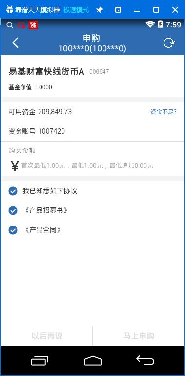

<p class="tip">
  基金交易页面逻辑
</p>

## 显示效果



基金交易页面的逻辑基本上和首页的逻辑一样，只是多了一个处理 `url` 入参，并且在每个 `GetSendData` 的入参中
填入。

## 界面配置

主要配置项是 `mob-form` 的配置，所以会经常性看到使用 `page_jjjy` 业务逻辑的界面配置会写成下面这样。

```
var mob_list_jjsg = {
  items: [
    {
      tplid: "mob-form",
      style: {},
      index: 0,
      rows: [
        {
          tplid: "mob-form-span",
          style: {
            height: "25px",
            marginTop: "20px"
          },
          cols: [
            {
              field: "403",
              style: {
                fontSize: "18px",
                fontWeight: "bold"
              }
            },
            {
              field: "402",
              style: {
                marginLeft: "10px",
                fontSize: "12px",
                color: "rgba(0, 0, 0, 0.5)"
              }
            }
          ]
        },
        {
          tplid: "mob-form-span",
          cols: [
            {
              name: "基金净值",
              style: {
                fontWeight: "bold"
              }
            },
            {
              field: "406",
              style: {}
            }
          ],
          split: {},
          style: {
            fontSize: "12px"
          }
        },
        {
          cols: [
            {
              name: "可用资金",
              style: {}
            },
            {
              field: "301",
              style: {},
              format: "2m"
            }
          ],
          op: {
            name: "资金不足?",
            style: {},
            urlFunc: jumpYzzz
          },
          style: {}
        },
        {
          cols: [
            {
              name: "资金账号",
              style: {}
            },
            {
              field: "zjzh",
              style: {}
            }
          ],
          style: {
            borderBottom: "1px solid #ddd"
          }
        },
        {
          tplid: "mob-form-input",
          title: {
            name: "购买金额",
            style: {
              color: "rgba(0,0,0,0.5)"
            }
          },
          input: {
            placeholder: "请输入购买金额",
            name: "￥",
            style: {
              fontSize: "26px",
              fontWeight: "bold",
              height: "30px",
              marginBottom: "5px"
            },
            field: "gmje",
          },
          split: {},
          getItem: getInputItem
        },
        {
          tplid: "mob-form-xys",
          field: "xysCheck",
          title: "我已知悉如下协议",
          urls: [],
          getUrls: getUrls,
          style: {},
          checkStyle: {},
          checkImage: ["uncheck.png", "check.png"],
        }
      ],
      foot: [
        {
          tplid: "mob-form-button",
          btns: [
            {
              name: "以后再说",
              style: {
                borderTop: "1px solid #ddd",
                borderRight: "1px solid #ddd",
                height: "40px",
              },
              disabledStyle: {},
              urlFunc: btnCaClick
            },
            {
              name: "马上申购",
              style: {
                borderTop: "1px solid #ddd",
                height: "40px",
                color: "#fff",
                backgroundColor: "#2E6BB1",
                borderColor: "#2E6BB1"
              },
              disabledStyle: {
                color: "#ddd",
                backgroundColor: "#fff",
                borderColor: "#ddd"
              },
              urlFunc: btnOkClick,
              checkDisabledFunc: checkDisabledFunc
            }
          ],
          style: {
            color: "#ddd",
            fontWeight: "bold"
          }
        }
      ]
    }
  ]
}
```

可以看到，最终还是回到了 `mob-form` 组件的配置，[点击详情](/doc/mob-form)

## 数据请求

和一般的逻辑一样，在 `GetSendData` 中执行数据的默认操作。

```
var code;
var count = 3;
var reccnt = 0;
var GetSendData = function(n, json) {
  
  var funcid;
  var ix = new IXContent();
  switch(n) {

    case 0:
      code = json["F402"] || "000647";
      funcid = "FW2.TSTC.2602";
      ix.Set("400", "1");
      ix.Set("402", code);
      break;
    default:
      break;
  }

  return [funcid, ix];
}

var SetDataField = function(data, n, vm) {

  if(n == 0) {
    data = data.rows && data.rows[0];
    data["zjzh"] = uinfo.ZJZH[0];

    // 获取基金账户
    getJjzh(data, vm);

    reccnt = 0;
    getXys("zms", data, vm);
    getXys("ht", data, vm);
    getXys("jss", data, vm);
  }

  return data;
}

var getJjzh = function(row, vm) {

  hqJyCallTql.send("TSTC.2636", [{}], function(data) {

    data = FormatResult(data);
    var rows = data.rows || [];
    for(var i = 0; i < rows.length; i++) {
      if(row["393"] == rows[i]["426"]) {
        row["417"] = row[i]["417"];
        break;
      }
    }
    
  });
}

var getXys = function(type, row, vm) {

  __hqCallTql.send("CWServ.tdxzx_jyfunc", [{
    "callno": "105",
    "pro_type": type,
    "pro_code": code,
    "pro_mm": "1"
  }], function(data) {
    reccnt ++;
    data = FormatResult(data);
    var url = data.rows && data.rows[0] && data.rows[0].url;
    if(type == "zms") {
      row["cpzms"] = url;
    }
    else if(type == "ht") {
      row["cpht"] = url;
    }
    else if(type == "jss") {
      row["fxjss"] = url;
    }

    if(reccnt == count) {
      vm.dataCache[0] = $.extend({}, row);
      vm.$forceUpdate();
    }
  });
}
```