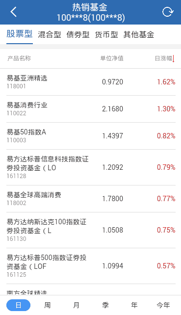

> 基金列表展示页面

## 0. 显示效果



## 1. mob_list_xxx.js

```
var mob_list_jjlist = {
  top: {
    tplid: "mob-bar-tab",
    tabs: [
      { title: "股票型", param: { "pro_type2": "11", "pro_type1_in": "(1)" } },
      { title: "混合型", param: { "pro_type2": "14", "pro_type1_in": "(1)" } },
      { title: "债券型", param: { "pro_type2": "13", "pro_type1_in": "(1)" } },
      { title: "货币型", param: { "pro_type2": "12", "pro_type1_in": "(1)" } },
      { title: "其他基金", param: { "pro_type2": "16", "pro_type1_in": "(1)" } },
    ],
    split: {},
    localStorageKey: "jjlist0"
  },
  body: {
    tplid: "mob-list-page",
    getCols: getCols,
    pageSize: 20,
    urlParam: {
      OpenName: "产品详情",
      OpenUrl: "jjxq.html",
      queryParams: [
        { key: "code", value: "pro_code" },
        { key: "pro_type1", value: "pro_type1"},
        { key: "pro_type2", value: "pro_type2"},
      ]
    }
  },
  foot: {
    tplid: "mob-bar-tab",
    toggleShow: toggleShow,
    tabs: [
      { title: "日", param: { "foot_field": "rzf" } },
      { title: "周", param: { "foot_field": "zzf" } },
      { title: "月", param: { "foot_field": "yzf" } },
      { title: "季", param: { "foot_field": "jzf" } },
      { title: "年", param: { "foot_field": "nzf" } },
      { title: "今年", param: { "foot_field": "jnzf" } },
    ],
    style: {
      borderTop: "1px solid #ddd",
      justifyContent: "space-around"
    },
    tabItemStyle: {
      "fontSize": "14px",
      "width": "50px",
      "height": "24px"
    },
    tabItemSelStyle: {
      "backgroundColor": "#4696F5",
      "color": "#fff",
      "border": "0",
      "borderRadius": "12px"
    },
    localStorageKey: "jjlist2"
  },
  sortClick: sortClick
}
```

界面分成 3 部分，顶部栏（top），列表区域（body），底部栏（foot）

### 1.1. sortClick

生成查询参数逻辑部分，这里拿出来是为了字段可配置。顶部，列表头，底部栏改变的时候
我们需要更新参数来做数据查询的准备。

```
var sortClick = function(param, queryParam) {

  param["@POS"] = 0;

  /* 
    顶部栏目切换

    重新查询，排序字段 非12类型给 foot_field, 12类型给 qrnhsy
  */
  if(param["pro_type2"] && param["pro_type2"] != queryParam["pro_type2"]) {

    param["sortType"] = "2";
    if(param["pro_type2"] == "12") {
      param["sortField"] = "qrnhsy";
    }
    else {
      param["sortField"] = queryParam["foot_field"] || "rzf";
    }
  }

  /* 
    foot 栏变化

    如果排序字段不是单位净值，改变排序字段
  */
  else if(!param["sortField"] && queryParam["sortField"] != "nav") {
    param["sortField"] = param["foot_field"];
  }

  /* 
    列表顶部栏点击排序变化，也不需要什么变化
  */
  return $.extend({}, queryParam, param);
}
```

#### 1.1.1 param

`param` 触发查询事件带的参数，这里有 2 种类型的组件，分别接受事件来做排序处理

```
tabItemClick: function(index) {

  if(index == this.itemSel) return;

  this.itemSel = index;
  localStorage[this.item.localStorageKey] = index;
  event.$emit("mob-bar-tab-item-click", this.item.tabs[index].param);
}
```

组件 `mob-bar-tab` 切换的时候，会取配置对应的 `param` 部分。

```
headColClick: function(col) {

  if(!col.sort) return;

  this.listToTop();

  let param = {};
  let footField = this.queryParam["foot_field"];
  let sortField = this.queryParam["sortField"] || footField;
  let sortType = this.queryParam["sortType"] || "2";
  
  if(col.field != sortField) {
    sortType = "2";
    sortField = col.field;
  }
  else {
    sortType = sortType == "2" ? "1" : "2";
  }

  event.$emit("mob-list-page-sort-click", { sortType, sortField });
}
```

组件 `mob-list-page` 点击顶部栏

```
event.$on("mob-bar-tab-item-click", this.onBarItemClick);
event.$on("mob-list-page-sort-click", this.onBarItemClick);

onBarItemClick: function(param) {

  // 清空数据，重新查询
  this.rows = undefined;

  if(typeof this.item.sortClick == "function") {
    this.queryParam = this.item.sortClick(param, this.queryParam);
  }

  event.$emit("mob-list-page-to-top");
  this.$nextTick(() => { this.queryData() });
}
```

#### 1.1.2 queryParam

上一次的查询参数

### 1.2 第一次查询默认参数的获取

进入界面的时候，或者刷新的时候，我们需要记住一些状态，如 `mob-bar-tab` 的选择 `index`。
这里的 `localStorageKey` 是存放状态的 `key`。

默认参数，我们通过一个函数来获得 `getDefQueryParam` （这个函数是必须实现的，不管你是在 mob_list_xxx.js 
还是在 mob_send_xxx.js 中实现）。

```
var getDefQueryParam = function(tdxConf) {

  var topSel = localStorage[tdxConf.top.localStorageKey] || 0;
  var footSel = localStorage[tdxConf.foot.localStorageKey] || 0;

  var topParam = tdxConf.top.tabs[topSel].param;
  
  if(topParam["pro_type2"] == "12") {
    
    return $.extend({}, topParam, {
      "sortField": "qrnhsy",
      "sortType": "2"
    });
  }
  
  var footParam = tdxConf.foot.tabs[footSel].param;
  return $.extend({}, topParam, footParam, { "@POS": 0 });
}
```

`tdxConf` 是 `mob_list_xxx` 变量的值，就是我们的界面配置。

### 1.3 中间 list 部分 item 是动态计算的

```
computed: {

  listItem: function() {

    let item = this.item.body;
    if(typeof item.getCols == "function") {
      item.cols = item.getCols(this.queryParam);
    }

    item.queryParam = this.queryParam;
    return $.extend({}, item);
  }
}
```

这里的 `cols` 部分，如果 `item.getCols` 被定义了，并且是一个函数，那么 `item`
中的 `cols` 会被重新计算赋值，这里的入参是我们的查询参数。

```
var getCols = function(queryParams) {

  var cplx = queryParams["pro_type2"] || "11";
  var zdlx = queryParams["foot_field"] || "rzf";
  
  // 货币型
  if(cplx == "12") {

    return [
      { title: "产品名称", field: "pro_name", subField: "pro_code", align: "left" },
      { title: "起购金额", field: "qgje", sort: true, format: ".2f" },
      { title: "七日年化收益", field: "qrnhsy", sort: true, format: "2%" },
      { title: "万份收益", field: "wfsy", sort: true, align: "right", format: ".4f" },
    ];
  }

  // 非货币型
  var cols = [
    { title: "产品名称", field: "pro_name", subField: "pro_code", width: "50%", align: "left" },
    { title: "单位净值", field: "nav", sort: true, width: "25%", format: ".4f" }
  ];
  var adCols = {
    "rzf": { title: "日涨幅", field: "rzf", sort: true, width: "25%", align: "right", format: "2%" },
    "zzf": { title: "周涨幅", field: "zzf", sort: true, width: "25%", align: "right", format: "2%" },
    "yzf": { title: "月涨幅", field: "yzf", sort: true, width: "25%", align: "right", format: "2%" },
    "jzf": { title: "季涨幅", field: "jzf", sort: true, width: "25%", align: "right", format: "2%" },
    "nzf": { title: "年涨幅", field: "nzf", sort: true, width: "25%", align: "right", format: "2%" },
    "jnzf": { title: "今年以来", field: "jnzf", sort: true, width: "25%", align: "right", format: "2%" }
  };

  cols.push(adCols[zdlx]);
  return cols;
}
```

### 1.4 toggleShow

```
var toggleShow = function(queryParams) {

  var cplx = queryParams["pro_type2"];
  return cplx == "12" ? false : true;
}
```

这个函数也是 `page_jjlist` 中需要的，用于判断是否要显示 `foot` 部分。

## 2. mob_send_xxx.js

```
var GetSendData = function(n, json) {

  var funcid;
  var ix = new IXContent();

  switch(n) {

    case 0:
      funcid = "HQ.TAS.product_code_query",
      ix.Set("pro_type1_in", json["pro_type1_in"]);
      ix.Set("pro_type2", json["pro_type2"]);
      ix.Set("orderby_field", json["sortField"] || json["foot_field"]);
      ix.Set("orderby_type", json["sortType"] || "2");
      ix.Set("@POS", json["@POS"] || "0");
      ix.Set("@COUNT", "20");
      break;
  }

  return [funcid, ix];
}

var SetDataField = function(data, n, vm) {

  if(n == 0) {
    data = data.rows;
  }

  return data;
}
```

标准的请求处理逻辑