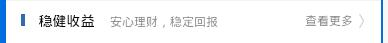
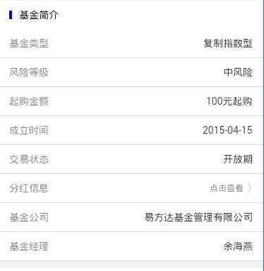
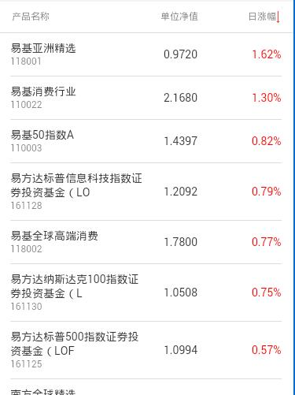
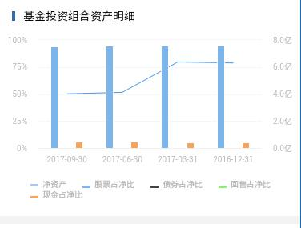
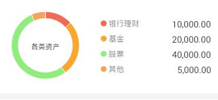
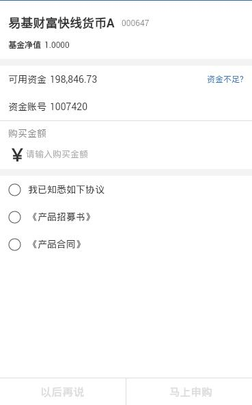
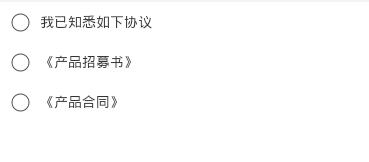

> 手机 APP 网厅商城项目

## 1. 怎么使用

### 1.0. 准备工作

安装 `node` 环境

```
> npm config set registry=http://192.168.2.206:4567/
```

通过 `npm config get registry` 获取当前配置的 `npm` 包地址，多个源地址管理，可以使用工具 `nrm`。

### 1.1. 使用工程

```
> npm install -g tdx-cli
> tdx-cli -c demo
> cd demo
> npm i
```

通过脚手架工具 `tdx-cli` 把 `demo` 工程 `clone` 下来，可以修改工程的描述信息文件 `package.json`。

### 1.2. 工程目录结构

```
/
  doc/
    ... 文档目录
  webApp/
    app/
      mall/
        ...       -- 手机商城代码部分
    libs/         -- 3方库
    tlibs/        -- tdx 库，包括 ts_client.js, connect.js
  src/
    commons/
      ... 一些公共 css，js文件
    components/
      ... 组件文件存放区域
    layout/
      ... 文件组织显示，单页面应用中会用到
    pages/
      ... 具体一个个功能业务
    res/
      ... 资源文件
    xxx.js  功能业务入口文件

  ... 一些工程配置文件，如 package.json, webpack.common.js, webpack.dev.js 等
```

## 2. 已实现的组件

### 2.1. 图片轮播组件 

 [详情](/doc/mob-slider-image)

### 2.2. 分隔组件

 [详情](/doc/mob-split)

### 2.3. 导航组件

#### 2.3.1 mob-nav-icon

 [详情](/doc/mob-nav-icon)

### 2.4. 卡片组件

#### 2.4.1 mob-card-op

 [详情](/doc/mob-card-op)

#### 2.4.2 mob-card

 [详情](/doc/mob-card)

#### 2.4.3 mob-card-jj

 [详情](/doc/mob-card-jj)

#### 2.4.3 mob-card-zj

 [详情](/doc/mob-card-zj)

#### 2.4.4 mob-card-dd

 [详情](/doc/mob-card-dd)

### 2.5. 顶部栏

#### 2.5.1 mob-bar

 [详情](/doc/mob-bar)

#### 2.5.2 mob-bar-tab

 [详情](/doc/mob-bar-tab)

### 2.6. 列表组件

#### 2.6.1 mob-list

 [详情](/doc/mob-list)

#### 2.6.2 mob-list-jjxq

 [详情](/doc/mob-list-jjxq)

#### 2.6.3 mob-list-page

 [详情](/doc/mob-list-page)

### 2.7. 图表组件

#### 2.7.1 mob-chart

 [详情](/doc/mob-chart)

#### 2.7.2 mob-chart-bar

 [详情](/doc/mob-chart-bar)

#### 2.7.3 mob-chart-pie

 [详情](/doc/mob-chart-pie)

### 2.8. 按钮组件

#### 2.8.1 mob-btn-single

 [详情](/doc/mob-btn-single)

## 2.9 查询日期组件

 [详情](/doc/mob-query-date)

## 2.10 表单组件

### 2.10.0 mob-form

 [详情](/doc/mob-form)

### 2.10.1 mob-form-span

 [详情](/doc/mob-form-span)

### 2.10.2 mob-form-input

 [详情](/doc/mob-form-input)

### 2.10.3 mob-form-button

 [详情](/doc/mob-form-button)

### 2.10.4 mob-form-xys

 [详情](/doc/mob-form-xys)

## 3. 一些代码解释

### 3.1 [GetSendData](/doc/GetSendData)

### 3.2 [fieldColor](/doc/fieldColor)

### 3.3 [urlParam](/doc/urlParam)

## 4. page

### 4.1 index 首页

商城首页逻辑 [详情](/doc/page_index)

### 4.2 jjxq

基金详情界面逻辑 [详情](/doc/page_jjxq)

### 4.3 jjlist

基金列表展示界面逻辑 [详情](/doc/page_jjlist)

### 4.4 wdlc

我的理财界面逻辑 [详情](/doc/page_wdlc)

### 4.5 ddcx

订单查询界面逻辑 [详情](/doc/page_ddcx)

### 4.6 jjjy

基金交易界面逻辑 [详情](/doc/page_jjjy)

## 5. 券商合作

扩展组件 [详情](/doc/plugin)